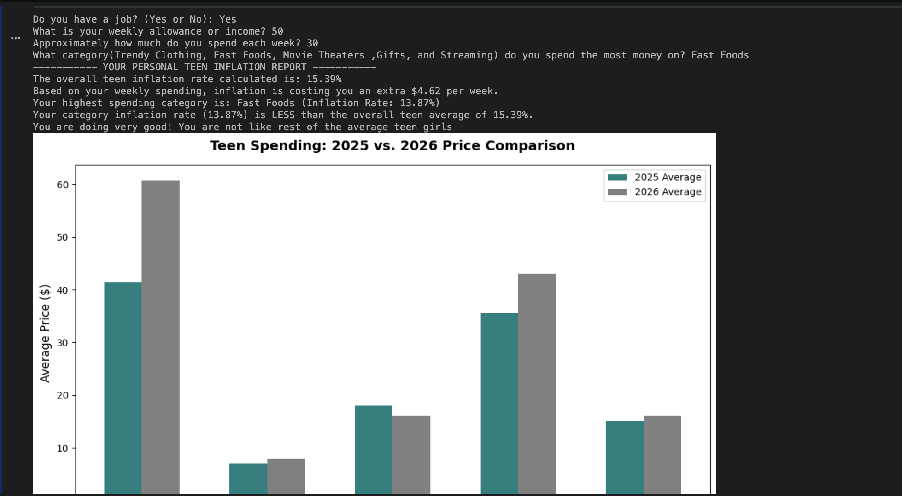

# Teen Inflation Tracker

## Overview

Teen Inflation Tracker is a Python project that estimates how inflation affects the purchasing power of teenagers by comparing average prices from 2025 and 2026.

## Features
- Calculates inflation rates
- Compares multiple spending categories
- Gives personalized budgeting advice
- Displays graphs
- Estimates purchasing power loss

## Technologies
- Python
- Matplotlib

## Categories
- Clothing
- Fast Food
- Movie Theaters
- Gifts
- Streaming

## Files

passion_project.py
Teen_Inflation_Research_Paper.pdf

Author: Janani Dandamudi
